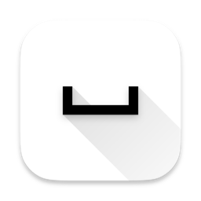

  <picture>
    <source media="(prefers-color-scheme: dark)" srcset="https://github.com/user-attachments/assets/1339ac43-8374-4951-95e9-9ea9d00aa631">
<!--     <source media="(prefers-color-scheme: light)" srcset="https://github.com/user-attachments/assets/ed2e2920-a09c-4b0a-b671-9642ff11f2cb"> -->
    
  </picture>
  <h1>NotchBar</h1>

NotchBar is a macOS app designed to utilize the empty space around the notch when connected to external displays.

### Before

### After

## Usage

After launching NotchBar, it will automatically cover the notch area of your MacBook.

A _sparkle_ icon will also be shown in the menu bar for important actions.

<!-- () -->
<!--  -->

## Installation

> Requirements: macOS 14.5 or later

1. Download the [latest release](https://github.com/navtoj/NotchBar/releases/latest/download/NotchBar.dmg) from the [Releases](https://github.com/navtoj/NotchBar/releases) page.
2. Drag the NotchBar app to your Applications folder.
3. Launch NotchBar from your Applications folder or Spotlight.

## Widgets

<table>
  <tr></tr>
  <tr><th colspan="5" align="left">📊 System Monitor</th></tr>
  <tr><td colspan="5"></td></tr>
  <tr>
    <td>CPU</td>
    <td>Memory</td>
    <td>Storage</td>
    <td>Battery</td>
    <td>Network</td>
  </tr>
</table>
<table>
  <tr></tr>
  <tr><th colspan="3" align="left">🎵 Media Playback</th></tr>
  <tr><td colspan="3"></td></tr>
  <tr>
    <td>Artwork</td>
    <td>Artist</td>
    <td>Track</td>
  </tr>
</table>
<table>
  <tr></tr>
  <tr><th colspan="2" align="left">📱 Active App</th></tr>
  <tr><td colspan="2"></td></tr>
  <tr>
    <td>Name</td>
    <td>Icon</td>
  </tr>
</table>

|✨|more coming soon...|
|-|:-|
<!-- || -->

## Contributing

Contributions to NotchBar are most welcome! Please feel free to submit a Pull Request.

## Building from Source

To build NotchBar from source:

1. Clone the repository: git clone https://github.com/navtoj/NotchBar.git
2. Open `NotchBar.xcodeproj` in Xcode.
3. Build and run the project.

## License

This project is licensed under the [AGPLv3 License](LICENSE).

## Acknowledgments

- [SystemInfoKit](https://github.com/Kyome22/SystemInfoKit) for live system information.
- [SFSafeSymbols](https://github.com/SFSafeSymbols/SFSafeSymbols) for safe usage of SF Symbols.
- [LaunchAtLogin-Modern](https://github.com/sindresorhus/LaunchAtLogin-Modern) for launch at login functionality.
- [Pow](https://github.com/EmergeTools/Pow) for SwiftUI effects.