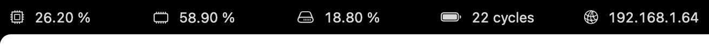

<div align="center">
  <picture>
    <source media="(prefers-color-scheme: dark)" srcset="_assets/icon/dark.png" />
    <source media="(prefers-color-scheme: dark)" srcset="_assets/icon/light.png" />
    
  </picture>
  <h1>NotchBar</h1>
</div>

NotchBar is a macOS app designed to utilize the empty space around the notch.

### Before


### After


## Installation

> Requirements: macOS 14.5 or later

1. Download the [`NotchBar.zip`](https://github.com/navtoj/NotchBar/releases/download/0.0.3.1/NotchBar.zip) from the [Releases](https://github.com/navtoj/NotchBar/releases/latest) page.
2. Unzip and drag the `NotchBar.app` to your **Applications** folder.
3. Launch **NotchBar** from your Applications folder or Spotlight.

> [!TIP]
> ### Can't open `NotchBar.app`?
<details>
<summary>Use this quick workaround.</summary><br>

> |Step 1|Step 2|Step 3|
> |:-|:-|:-|
> |Click `Show in Finder`|_Right_ Click `NotchBar.app` → Click `Open`|Again, Click `Open`|
> |[^1]|||
> #### If the `Show in Finder` button is not visible...
> [^2]
>
> |Step 0|
> |:-|
> |Open `Terminal` → Run `chmod +x /Applications/NotchBar.app/Contents/MacOS/NotchBar`|
> ||

[^1]: This popup appears because Apple requires a **CAD $119** yearly subscription to remove it.
[^2]: This popup appears because the macOS `Archive Utility` breaks file permissions for the executable within the `.app` bundle.
</details>

## Usage

After launching NotchBar, it will automatically cover the notch area of your MacBook.

A _sparkle_ icon will also be shown in the menu bar for important actions.


> [!TIP]
> ### Can't see the `NotchBar`?
<details>
<summary>It might be covered by the macOS menu bar.</summary><br>

> **Option 1 —** Set **`Automatically hide and show the menu bar`** option to **`Always`**
> 
> <br>**Option 2 —** Set **`Displays have separate Spaces`** option to **`Off`**
> 
</details>

## Widgets

<table>
  <tr></tr>
  <tr><th colspan="5" align="left">📊 System Monitor</th></tr>
  <tr><td colspan="5"></td></tr>
  <tr>
    <td>CPU</td>
    <td>Memory</td>
    <td>Storage</td>
    <td>Battery</td>
    <td>Network</td>
  </tr>
</table>
<table>
  <tr></tr>
  <tr><th colspan="3" align="left">🎵 Media Playback</th></tr>
  <tr><td colspan="3"></td></tr>
  <tr>
    <td>Artwork</td>
    <td>Artist</td>
    <td>Track</td>
  </tr>
  <tr><td colspan="3"></td></tr>
  <tr><td colspan="3">Dropdown Details Card w/ Controls</tr>
</table>
<table>
  <tr></tr>
  <tr><th colspan="2" align="left">📱 Active App</th></tr>
  <tr><td colspan="2"></td></tr>
  <tr>
    <td>Name</td>
    <td>Icon</td>
  </tr>
</table>

|✨|more coming soon...|
|-|:-|

### Widget Structure

```
Widgets
├── Example
│   ├── PrimaryView.swift
│   └── SecondaryView.swift
└── WidgetView.swift
```

```swift
WidgetView(

    // Required – Always Visible in Notchbar

    primary: PrimaryView.init,

    // Optional – Dropdown Card on Tap/Hover

    secondary: SecondaryView.init
)
```

## Development

Contributions are most welcome! Please feel free to submit a Pull Request.

### Install [Tuist](https://github.com/tuist/tuist)

```shell
brew tap tuist/tuist
brew install --formula tuist
```

### Clone Repository

```shell
git clone https://github.com/navtoj/NotchBar.git
cd NotchBar/src/
```

### Install Dependencies

```shell
tuist install && tuist build
```

### Launch Xcode (Optional)

```shell
tuist generate
```

## License

This project is licensed under the [AGPLv3 License](LICENSE).

## Acknowledgments

- [SystemInfoKit](https://github.com/Kyome22/SystemInfoKit) for live system information.
- [SFSafeSymbols](https://github.com/SFSafeSymbols/SFSafeSymbols) for safe usage of SF Symbols.
- [LaunchAtLogin-Modern](https://github.com/sindresorhus/LaunchAtLogin-Modern) for launch at login functionality.
- [Pow](https://github.com/EmergeTools/Pow) for SwiftUI effects.

## Repo Stats


<a href="https://star-history.com/#navtoj/notchbar&Timeline">
 <picture>
   <source media="(prefers-color-scheme: dark)" srcset="https://api.star-history.com/svg?repos=navtoj/notchbar&type=Timeline&theme=dark" />
   <source media="(prefers-color-scheme: light)" srcset="https://api.star-history.com/svg?repos=navtoj/notchbar&type=Timeline" />
   
 </picture>
</a>
