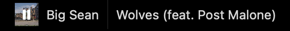
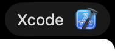

# Development

Contributions are most welcome! Please feel free to submit a Pull Request.

### Clone Repository

```shell
git clone https://github.com/navtoj/NotchBar.git
cd NotchBar/swift/
```

### Install Dependencies

<details>
<summary>Don't have <code>tuist</code> installed?</summary>

#### Install [Tuist](https://github.com/tuist/tuist)

```shell
brew tap tuist/tuist
brew install --formula tuist
```

</details>

```shell
tuist install && tuist build
```

### Launch Xcode (Optional)

```shell
tuist generate
```

## Widgets

<details>
	<summary>View Examples</summary><br>
<table>
  <tr></tr>
  <tr><th colspan="5" align="left">📊 System Monitor</th></tr>
  <tr><td colspan="5"></td></tr>
  <tr>
    <td>CPU</td>
    <td>Memory</td>
    <td>Storage</td>
    <td>Battery</td>
    <td>Network</td>
  </tr>
</table>
<table>
  <tr></tr>
  <tr><th colspan="3" align="left">🎵 Media Playback</th></tr>
  <tr><td colspan="3"></td></tr>
  <tr>
    <td>Artwork</td>
    <td>Artist</td>
    <td>Track</td>
  </tr>
  <tr><td colspan="3"></td></tr>
  <tr><td colspan="3">Dropdown Details Card w/ Controls</tr>
</table>
<table>
  <tr></tr>
  <tr><th colspan="2" align="left">📱 Active App</th></tr>
  <tr><td colspan="2"></td></tr>
  <tr>
    <td>Name</td>
    <td>Icon</td>
  </tr>
</table>
<table>
  <tr></tr>
  <tr><th>✨</th><th>more coming soon...</th></tr>
</table>
</details>

### Structure

```
Widgets
├── Example
│   ├── PrimaryView.swift
│   └── SecondaryView.swift
└── WidgetView.swift
```

```swift
WidgetView(

    // Required – Always Visible in Notchbar

    primary: PrimaryView.init,

    // Optional – Dropdown Card on Tap/Hover

    secondary: SecondaryView.init
)
```

## Acknowledgments

-   [SystemInfoKit](https://github.com/Kyome22/SystemInfoKit) for live system information.
-   [SFSafeSymbols](https://github.com/SFSafeSymbols/SFSafeSymbols) for safe usage of SF Symbols.
-   [LaunchAtLogin-Modern](https://github.com/sindresorhus/LaunchAtLogin-Modern) for launch at login functionality.
-   [Pow](https://github.com/EmergeTools/Pow) for SwiftUI effects.
